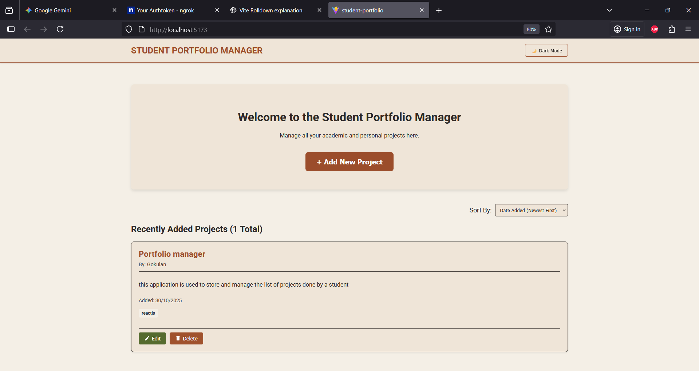

# Student Portfolio Management System (SPMS) - DevOps Lab Submission

**GitHub Repository Link:** https://github.com/Gokulan-SK/devops-practical-exam

## I. Project Overview and Features

The SPMS is a React application providing **CRUD (Create, Read, Update, Delete)** functionality for managing student projects. Data persistence is achieved using **`localStorage`** on the client side.

### Mandatory Requirements Implemented:
* **Data Model:** Each record includes Student Name, Project Title, and detailed Project Details (Tech Stack, Description, Links).
* **Data Persistence:** Uses `useLocalStorage` hooks to maintain state across browser sessions.

### Customized Features (Mandatory):
1.  **Dark Mode Theme Toggle:** A switch in the Navbar that persists the user's theme preference via `localStorage`.
2.  **Project Sorting Functionality:** Allows users to sort the project list on the main dashboard by **Date Added (Newest/Oldest)** and **Project Title (A-Z)**.

---

## II. Steps Followed for DevOps Pipeline Setup

### 1. Git & Branching Strategy (Task Steps 1 & 2)
1.  Project initialized with Vite and pushed to GitHub.
2.  Development occurred on a feature branch (`feature/core-crud-logic`).
3.  Code was merged into the **`main`** branch using `git merge --allow-unrelated-histories` to resolve history conflicts.
4.  The final working code, including the `Jenkinsfile`, resides on the **`main`** branch.

### 2. Jenkins Pipeline Configuration (Task Step 3)
The pipeline is defined in the **`Jenkinsfile`** and configured to run on a Windows agent.
* **Tool Setup:** Installed the NodeJS plugin and configured the `nodejs-18` tool.
* **Build Commands:** Shell commands were modified from `sh` to **`bat`** to ensure compatibility with the Windows agent.
* **Archiving:** The final stage uses `archiveArtifacts 'dist/**'` to save the built React application files.

### 3. Webhook Execution (Task Step 4)
* The Jenkins job was configured with the **"GitHub hook trigger for GITScm polling"** option.
* A public tunnel was established using **Ngrok** to expose the local Jenkins server (`http://localhost:8080`) to the public Internet.
* The GitHub Webhook was successfully set to the Ngrok URL: `[Your Ngrok URL]/github-webhook/`.
* The pipeline was successfully **triggered by pushing code** to GitHub.

---

## III. Task Output & Proof (Task Step 5)

### 1. Running Application in Browser

### 2. Jenkins Build Success Console Output

### 3. README Screenshot/Logs
